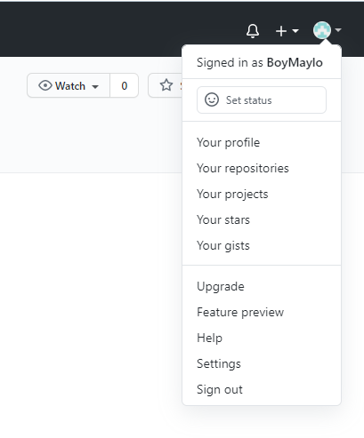
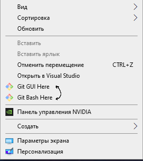

# Лабораторная работа №6
# Курахтанов даниил 4917

Цель лабораторной работы: изучение базовых возможностей системы управления версиями, опыт работы с Git Api, опыт работы с локальным и удаленным репозиторием.

Создание аккаунта GitHub:

Установливаю систему контроля версий GUI:

Добавил репозиторий https://github.com/Kurtyanik/LR6.git в свой репозиторий:

История операций:

Объединение веток master и branch1 получилось с ошибкой:

Файл до исправления:

Файл после исправления:

Удаление побочной ветки:

Переименовал файл README в Lookme, после чего сделал "хард" откат коммита:

История комманд:

Вывод: изучил базовые возможности системы управления версиями Git Api, работу с локальным и удаленным репозиторием. 

